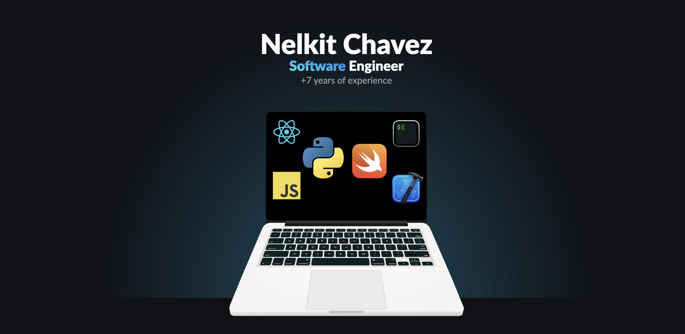

### Social 👋

    
    
    

### Acerca de Mi 👨🏽‍💻

Mi nombre es Nelkit Chavez soy desarrollador de software, actualmente especializado en **Desarrolló de Aplicaciones Moviles**; nací en Honduras y me gradúe en la Universidad Politécnica de Ingeniería como **Ingeniero en Tecnologías de Información y Comunicación**, Trabajo actualmente en una empresa de movilidad urbana llamada [Ryte](https://www.ryte.hn).

Estoy en el mundo de desarrollo de software profesional desde el año 2015 y a lo largo de estos años he ganado bastante experiencia en las empresas en las que he trabajado y las más de cinco consultorías que he realizado.

Soy fan de los productos de **Apple** y me apasiona desarrollar aplicaciones en **Swift**, sin embargo tambien me encanta el desarrollo web por lo que he adquirido buenos conocimientos en **Javascript** y **Python**, especialmente en tecnologías como **ReactJS** y **Django**. Constantemente estoy educándome e investigando nuevas tecnologías lo que me permite adquirir nuevas habilidades día tras día, actualmente estoy enfocando en mejorar mis conocimientos en **Inteligencia Artificial**.

 Para más información descargar mi resumen aca: [Descargar](https://drive.google.com/file/d/15eChKfjO80IrAI3TEooLIsZskKa-nIIa/view?usp=sharing)